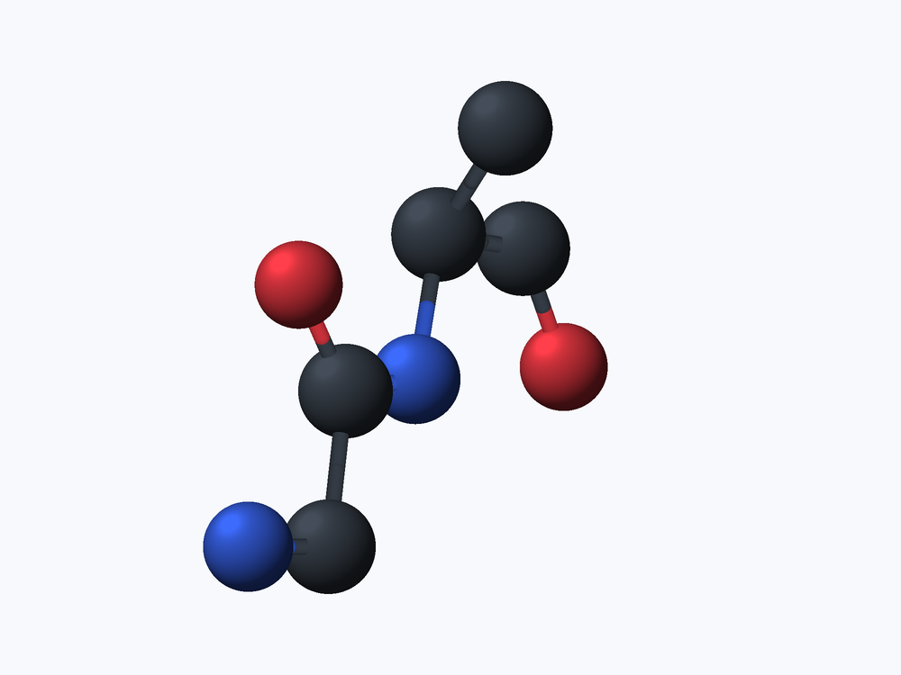
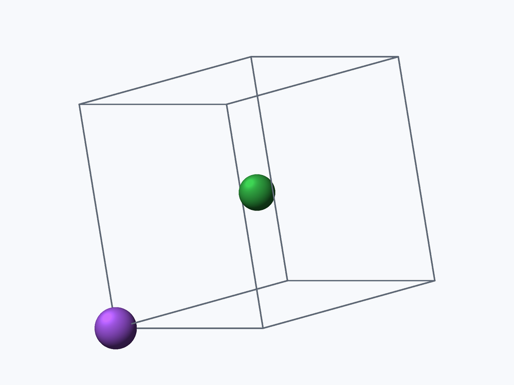

# xyz-read

`xyz-read` is a read-only command-line tool for inspecting, querying, and rendering molecules, proteins, crystals, and trajectories. It is designed for agent workflows: inspect structured metadata, select an exact region, generate labeled candidate views, let a human choose one, and reproduce the chosen image from a hashed JSON view specification.

It runs headlessly and includes its own CPU 3D renderer. No GUI, browser, Python runtime, or external molecular viewer is needed.

`xyz-read` deliberately does not edit structures. Use RDKit or another chemistry toolkit to generate conformers, add hydrogens, change bonds, or write structure files; then use `xyz-read` to inspect and render the result.






## Install

Linux and macOS users can install the latest prebuilt release with:

```sh
curl -fsSL https://raw.githubusercontent.com/EvoEvolver/xyz-read/main/install.sh | sh
```

The installer detects the operating system and CPU, downloads the matching release, verifies its SHA-256 checksum, and installs `xyz-read` to `~/.local/bin`.

To choose another directory or pin a release:

```sh
curl -fsSL https://raw.githubusercontent.com/EvoEvolver/xyz-read/main/install.sh | \
  XYZ_READ_INSTALL_DIR="$HOME/bin" XYZ_READ_VERSION=v0.3.0 sh
```

Prebuilt archives are published for Linux x86-64/ARM64 and macOS Intel/Apple Silicon on the [Releases](https://github.com/EvoEvolver/xyz-read/releases) page.

## Agent quick start

Inspect before rendering:

```sh
xyz-read inspect protein.pdb --json
```

Query a binding site without modifying the structure:

```sh
xyz-read query protein.pdb \
  --select 'around:5@ligand' --summary
```

Generate six labeled alternatives, their replayable view specs, a contact sheet, and a manifest:

```sh
xyz-read views protein.pdb \
  --select 'around:5@ligand' \
  --highlight ligand \
  -o candidates
```

After a human chooses panel D, reproduce it directly:

```sh
xyz-read render --spec candidates/D.view.json \
  -o chosen.png --report chosen.json
```

Create and revise an explicit view without regenerating command arguments:

```sh
xyz-read plan ligand.sdf -o view.json \
  --atom-numbers --numbering rdkit

xyz-read revise view.json -o closer.json \
  --zoom-by 1.3 --rotate-y-by 20

xyz-read render --spec closer.json \
  -o closer.png --report closer-report.json
```

View specs contain the selected frame, selection, camera, dimensions, numbering mode, and input SHA-256. Rendering refuses to use a spec if the referenced structure has changed.

## Selection language

Selections are read-only. They affect query results and which atoms are shown, never the source file.

```text
all                         every atom
protein, polymer            PDB/mmCIF ATOM records
ligand                      non-water HETATM records and MOL/SDF/MOL2 atoms
water                       HOH, WAT, DOD, or H2O residues
ion                         common PDB ion residues
index:1,3..8                one-based input positions
rdkit-index:0,2..7          zero-based RDKit atom indices
element:C,N                 element symbols
chain:A,B                   chain identifiers
residue:40..60,HEM          residue numbers, names, or complete labels
atom:CA,N,O                 source atom names
within:5@ligand             atoms within 5 angstrom of the ligand
around:5@ligand             nearby atoms expanded to complete residues
byres(SELECTION)            expand matched atoms to complete residues
```

Combine selectors using `&` (intersection), `|` (union), `!` (negation), and parentheses. Quote expressions so the shell does not interpret these operators:

```sh
xyz-read render protein.pdb -o pocket.png \
  --select '(chain:A & residue:40..60) | ligand'
```

An empty selection is an error instead of silently producing a blank image.

Use `query --summary` for large structures. It keeps counts, element/role distributions, and residue records while omitting the potentially large atom and bond arrays. Run the same query without `--summary` when exact coordinates and indices are needed.

Use a contrasting outline to keep an important component visible inside its context:

```sh
xyz-read render protein.pdb -o pocket.png \
  --select 'around:5@ligand' --highlight ligand
```

Highlighting changes only the rendered view. It does not change elements, coordinates, bonds, or the source file.

## RDKit integration

RDKit and `xyz-read` have separate responsibilities:

- RDKit creates or edits the molecule and writes MOL/SDF.
- `xyz-read` preserves the resulting atom order, coordinates, explicit connectivity, and bond orders.
- RDKit's `Atom.GetIdx()` is zero-based. Use `rdkit-index:` selectors and `--numbering rdkit` to use the same values in queries and images.
- `xyz-read` never writes a modified MOL/SDF back to disk.

For a file-based workflow:

```python
# make_conformer.py
from rdkit import Chem
from rdkit.Chem import AllChem

mol = Chem.AddHs(Chem.MolFromSmiles("CC(=O)OC1=CC=CC=C1C(=O)O"))
params = AllChem.ETKDGv3()
params.randomSeed = 0xC0FFEE
AllChem.EmbedMolecule(mol, params)
AllChem.MMFFOptimizeMolecule(mol)
Chem.MolToMolFile(mol, "aspirin.mol")
```

```sh
python make_conformer.py
xyz-read query aspirin.mol --select 'rdkit-index:0..5'
xyz-read render aspirin.mol -o aspirin.png \
  --atom-numbers --numbering rdkit
```

For a pipeline, print a MOL block to stdout:

```python
# make_conformer_stdout.py
from rdkit import Chem
from rdkit.Chem import AllChem

mol = Chem.AddHs(Chem.MolFromSmiles("CCO"))
AllChem.EmbedMolecule(mol, randomSeed=42)
print(Chem.MolToMolBlock(mol))
```

```sh
python make_conformer_stdout.py | \
  xyz-read render - --format mol -o ethanol.png \
    --atom-numbers --numbering rdkit
```

Use an SDF containing multiple records to expose them as `xyz-read` frames. `--frame 1`, `--frame 2`, and `--frame last` then select the desired record.

## Machine interface

Discover the installed binary's contract:

```sh
xyz-read capabilities
```

The JSON response reports the schema version, formats, selectors, numbering modes, stdin support, RDKit boundary, and the explicit `read_only`/`structure_editing` guarantees.

Print the bundled formal schema for any machine document without network access:

```sh
xyz-read schema view
xyz-read schema query
xyz-read schema render-report
xyz-read schema candidate-manifest
```

`inspect --json`, `query`, candidate manifests, view specs, render reports, and JSON errors all include `schema_version`. Inspection and query results also include the input SHA-256. Normal stdout contains results; operation errors go to stderr. Ask for structured errors with:

```sh
xyz-read --json-errors query molecule.sdf \
  --select 'rdkit-index:999999'
```

Use global `--compact` to remove JSON formatting whitespace and reduce agent context usage:

```sh
xyz-read --compact query protein.pdb --select ligand
xyz-read --compact inspect trajectory.xyz --json
```

A render report includes input and image hashes, resolved frame, selection, selected atom count, drawn bond count, camera, and output dimensions:

```sh
xyz-read render molecule.sdf -o image.png \
  --report image.json
```

## Supported formats

| Format | Detection | Preserved data |
| --- | --- | --- |
| XYZ / extended XYZ | `.xyz` | Repeated frames; extra atom columns are accepted |
| PDB | `.pdb`, `.ent` | `MODEL` frames, `CONECT`, `CRYST1`, atom names, residues, chains, serials |
| CIF / mmCIF | `.cif`, `.mmcif`, `.mcif` | Cartesian/fractional coordinates, models, cell parameters, `_geom_bond`, protein metadata |
| MOL / SDF | `.mol`, `.sdf`, `.sd` | V2000/V3000 atoms, explicit bonds and bond orders, multiple SDF records |
| MOL2 | `.mol2` | Multiple molecules, atom types, residue names, explicit connectivity |
| POSCAR / CONTCAR | those filenames, `.vasp`, `.poscar` | Direct/Cartesian coordinates and lattice vectors |

Detection uses both the file name and contents. Override it for unusual names or stdin:

```sh
xyz-read inspect downloaded.data --format mmcif --json
xyz-read inspect - --format sdf --json < generated.sdf
```

## Connectivity

- MOL, SDF, and MOL2 bond tables are treated as complete and rendered exactly as supplied. Double and triple bonds use parallel strokes.
- PDB `CONECT` and CIF `_geom_bond` records are preserved, then missing local bonds are inferred because polymer files commonly omit ordinary bonds.
- XYZ, POSCAR, and structures without bond records use spatial hashing and covalent radii to infer bonds.
- `--no-bonds` suppresses explicit and inferred bonds.

When a selection is rendered, only bonds whose two endpoints are selected are retained.

## Proteins and crystals

PDB `MODEL` blocks and mmCIF model numbers become selectable frames. Alternate PDB locations other than blank, `A`, or `1` are skipped to avoid duplicate conformers. Query records retain atom names, residue names/numbers, chains, input indices, and source serials.

CIF fractional coordinates and POSCAR direct coordinates use the full triclinic lattice. Draw the cell boundary with:

```sh
xyz-read render structure.cif -o structure.png --unit-cell
```

`--unit-cell` returns an error when the selected frame has no cell data.

## Direct rendering

Every direct render is deterministic for the same input and arguments:

```sh
xyz-read render molecule.xyz -o image.png \
  --frame last --view iso \
  --rotate-x -15 --rotate-y 45 --rotate-z 5 \
  --zoom 1.4 --width 1000 --height 750
```

The compatibility commands `zoom-in`, `zoom-out`, and `rotate` remain available. They are stateless: view specs plus `revise` are preferred for multi-step agent workflows.

PNG, JSON specs, manifests, and reports are written atomically. An interrupted operation does not leave a partial destination file.

## License

MIT
