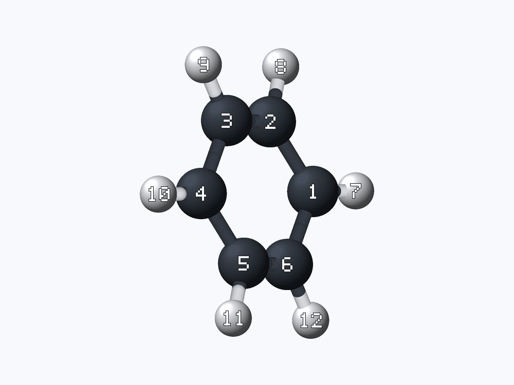

# xyz-read

`xyz-read` is a small command-line tool for inspecting XYZ molecular trajectories and rendering selected frames as PNG images. It is designed for agent workflows: inspect structured metadata first, render a candidate, adjust frame, zoom, or rotation, and show the result to a human.

It runs headlessly and includes its own CPU 3D renderer. No GUI, browser, or external molecular viewer is needed.



## Install

Linux and macOS users can install the latest prebuilt release with:

```sh
curl -fsSL https://raw.githubusercontent.com/EvoEvolver/xyz-read/main/install.sh | sh
```

The installer detects the operating system and CPU, downloads the matching release, verifies its SHA-256 checksum, and installs `xyz-read` to `~/.local/bin`.

To choose another directory or pin a release:

```sh
curl -fsSL https://raw.githubusercontent.com/EvoEvolver/xyz-read/main/install.sh | \
  XYZ_READ_INSTALL_DIR="$HOME/bin" XYZ_READ_VERSION=v0.1.0 sh
```

Prebuilt archives are also available on the [Releases](https://github.com/EvoEvolver/xyz-read/releases) page for:

- Linux x86-64 and ARM64
- macOS Intel and Apple Silicon

## Quick start

Inspect a single-frame XYZ file or a multi-frame trajectory:

```sh
xyz-read inspect trajectory.xyz
xyz-read inspect trajectory.xyz --json
```

Render the first frame:

```sh
xyz-read render trajectory.xyz -o frame.png
```

Render a particular frame with atom numbers:

```sh
xyz-read render trajectory.xyz -o frame-7.png --frame 7 --atom-numbers
```

Use `last` when the trajectory length is not known in advance:

```sh
xyz-read render trajectory.xyz -o final.png --frame last
```

## Agent workflow

The JSON inspection output is intended to be the first step:

```sh
xyz-read inspect trajectory.xyz --json
```

It reports the total frame count and, for each frame, its 1-based number, comment, atom count, element counts, and coordinate bounds. An agent can then render one or more candidates without changing the XYZ input:

```sh
xyz-read render trajectory.xyz -o candidate.png \
  --frame 12 --atom-numbers --rotate-y 35
```

After human review, the agent can adjust just the view:

```sh
xyz-read zoom-in trajectory.xyz -o closer.png \
  --frame 12 --atom-numbers --rotate-y 35 --factor 1.4

xyz-read rotate trajectory.xyz -o alternate.png \
  --frame 12 --atom-numbers --rotate-x 20 --rotate-y 70
```

Every image-producing command accepts the same frame, size, base view, rotation, atom-number, and bond options. This makes revisions explicit and reproducible.

## Frames and trajectories

Standard repeated XYZ blocks are treated as animation or trajectory frames:

```text
3
frame 1
O  0.000  0.000  0.000
H  0.758  0.586  0.000
H -0.758  0.586  0.000
3
frame 2
O  0.000  0.000  0.050
H  0.780  0.600  0.000
H -0.780  0.600  0.000
```

Frame numbers start at 1. Use `--frame NUMBER` or `--frame last`. Extra columns after Z coordinates are accepted and ignored, which allows many extended XYZ files to render directly.

## Zoom and rotation

Use an absolute zoom on any image command:

```sh
xyz-read render molecule.xyz -o image.png --zoom 1.8
```

Or use the intent-oriented commands:

```sh
xyz-read zoom-in molecule.xyz -o close.png --factor 1.5
xyz-read zoom-out molecule.xyz -o wide.png --factor 1.5
```

`zoom-in` multiplies `--zoom` by `--factor`; `zoom-out` divides it. The factor must be greater than 1.

Rotation values are degrees and compose across X, Y, and Z:

```sh
xyz-read rotate molecule.xyz -o rotated.png \
  --rotate-x -15 --rotate-y 45 --rotate-z 5
```

The default `--view iso` gives a three-quarter view. `--view x`, `--view y`, and `--view z` provide axis-aligned starting views; rotations are applied on top of that base view.

## Rendering options

```text
--frame NUMBER|last     Select a 1-based trajectory frame
--width PIXELS          Output width, 128 to 4096 (default: 1000)
--height PIXELS         Output height, 128 to 4096 (default: 750)
--zoom FACTOR           Absolute zoom, 0.05 to 20 (default: 1)
--view iso|x|y|z        Choose the base camera direction
--rotate-x DEGREES      Rotate around X
--rotate-y DEGREES      Rotate around Y
--rotate-z DEGREES      Rotate in the image plane
--atom-numbers          Overlay stable 1-based atom indices
--no-bonds              Disable inferred bonds
```

Run `xyz-read --help` or `xyz-read <command> --help` for the complete command reference.

## Renderer

The built-in renderer is implemented in this repository. It centers and rotates 3D coordinates, infers bonds from covalent radii, auto-fits the selected frame, rasterizes shaded atom spheres and bonds with a depth buffer, and downsamples a larger working image for smoother edges. Atom numbers use an embedded bitmap font, so output does not depend on system fonts.

Rendering is deterministic for the same input and arguments. PNG output is written atomically, so an interrupted render does not leave a partial destination file.

## License

MIT
